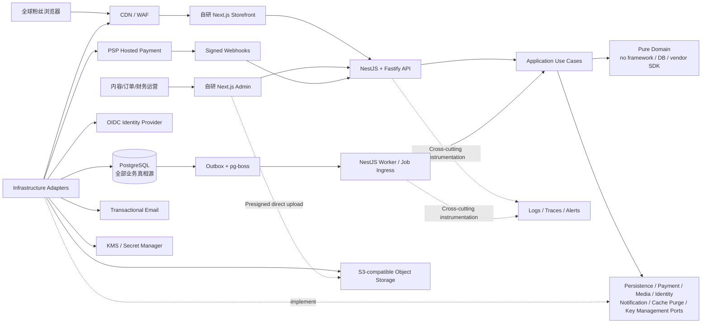

# Project Overview

> 基线日期：2026-09-02  
> 权威规范：`docs/FAN_SUPPORT_PLATFORM_SPEC.md`

## 1. 当前状态

本目录是绿地项目：当前只有参考站调研、截图、技术证据、架构图和 2.1.0 设计约束，没有应用代码、包管理配置、数据库迁移、测试或部署环境。因此 Phase 0 的第一项工作是建立可运行骨架，而不是在未知旧代码上重构。

现有材料：

- `docs/双站调研与类似平台技术架构规划.md`：mxcheer 与 Sonny Star/Vivid Live Star 的产品、交互和架构调研。
- `research/mxcheer/`、`research/sonnystar/`：桌面、移动、购物与政策页面证据。
- `research/tech/`：HTTP、HTML、sitemap 和技术推断证据。
- `docs/FAN_SUPPORT_PLATFORM_SPEC.md`：经用户后续确认收敛后的开发基线，优先级高于旧研究中的扩展设想。
- `docs/fan-support-platform-architecture.drawio`：全源码自研架构可视化；七语言细节由 2.1.0 规范与 ADR-006 定义，规范正文仍为最终权威。

## 2. 已确认问题

要解决的不是“另一个综合电商平台”，而是一个高度聚焦的粉丝礼物应援闭环：

```text
看偶像 → 选礼物 → 留下私密留言/匿名偏好 → 支付 → 查看准备与送达状态
```

核心约束：

- 无需账号即可完成购买。
- 英文 `en` 是主/源语言，粉丝可在 `zh-CN/th/vi/ja/es/pt` 间切换；语言不得改变 market、currency、价格、购物车或支付能力。
- 偶像照片与精品视觉是首要体验，不牺牲支付清晰度。
- PostgreSQL 管内容版本、商品、价格簿、库存、购物车、订单、履约、审计和支付编排。
- 前台、管理后台、商城核心和部署定义全部由本仓库实现；PSP 只处理合规支付认证与资金结果。
- MVP 不做社区、榜单、活动众筹、偶像入驻、分账和余额。

## 3. 目标系统



## 4. 关键数据边界

| 边界 | 真相源 | 不能发生 |
|:--|:--|:--|
| 偶像/海报/首页/政策/动态翻译 | PostgreSQL revisions + 显式 translation rows | 在前端源码硬编码正式内容、万能 JSON 翻译或原地覆盖历史 |
| 静态 UI/错误/校验消息 | 源码中的七语言类型化 ICU 目录 | 缺 key、展示 key、把 locale 当国家/币种 |
| 礼物/价格/库存 | PostgreSQL catalog/price books/ledger | 用缓存、分析或 PSP 金额反向覆盖真相源 |
| 私密留言/署名 | 加密 `support_intent` | 明文写公共 DTO、对象元数据、日志或分析 |
| 媒体 | 对象存储二进制 + PostgreSQL 元数据 | 把对象 key 当作未经校验的公开 URL |
| 支付最终状态 | 验签 provider event 或经认证且审计的 reconcile evidence | 相信浏览器回跳直接改为成功 |
| 准备/送达 | PostgreSQL append-only 事件/投影 | 运营绕过状态机直接覆写 |
| 支付密钥 | Secret Manager | 进仓库、数据库或客户端 bundle |

## 5. 外部依赖

- 托管 PostgreSQL。
- S3 兼容对象存储、CDN/WAF 与容器运行平台。
- 管理员 OIDC 身份源与 MFA。
- 至少一个符合经营主体/市场资格的 PSP sandbox/生产账户。
- 事务邮件供应商。
- OpenTelemetry 后端与错误监控。
- 商户主体、KYC、银行账户、支付资格和正式政策。
- 已授权的偶像肖像、礼物媒体和品牌资产。

## 6. 第一条可交付纵切片

Phase 0–4 结束时必须形成一条真实可验证路径：

1. 运营在自研 Admin 发布一位测试偶像、一个适用礼物、价格和库存。
2. 粉丝在移动或桌面以 `en/zh-CN/th/vi/ja/es/pt` 查看偶像与礼物，语言切换保持同一实体、购物车、market 与 currency。
3. API 在一个数据库事务内校验关系并创建 cart item 与加密 `support_intent`。
4. checkout 重新定价，锁定 CheckoutQuote/OrderAmount，预占库存并创建 `PENDING_PAYMENT` 订单和快照。
5. PSP sandbox 托管页面/字段完成支付。
6. 验签 webhook（或受控 reconcile）幂等提交库存并推进支付/订单状态。
7. 粉丝把高熵 token 一次性交换为受限 HttpOnly 会话后按订单固化 locale 查看 `PAID` 并收到同语言通知，运营更新为 `PREPARING/DELIVERED`。

没有真实 PostgreSQL/对象存储 fixture、PSP 签名 webhook/reconcile fixture 和浏览器证据时，不得将这条纵切片标记完成。
