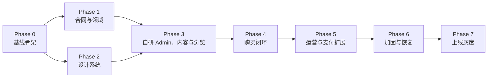

# Dependency Graph

## 1. Phase 级依赖



## 2. 关键路径

```text
P0-01 → (P0-02 + P0-03) → P0-04 → P0-05 → [Phase 0 Gate]

[Phase 0 Gate] → P1-01 → (P1-02 + P1-03) → P1-04 → P1-05 → P1-06 → [Phase 1 Gate]
[Phase 0 Gate] → P2-01 → P2-02 → (P2-03 + P2-04) → P2-05 → P2-06 → [Phase 2 Gate]

[Phase 1 Gate + Phase 2 Gate]
  → P3-01 → (P3-02 + P3-04) → (P3-03 + P3-05) → P3-06 → [Phase 3 Gate]
  → P4-01 → P4-02 → P4-03 → P4-04 → P4-05 → P4-06 → [Phase 4 Gate]
  → (P5-01 + P5-04) → (P5-02 + P5-03) → (P5-05 + P5-06) → P5-07 → P5-08 → [Phase 5 Gate]
  → P6-01 → P6-02 → P6-03 → P6-04 → P6-05 → P6-06 → [Phase 6 Gate]
  → (P7-01 + P7-04) → P7-02 → P7-03 → P7-05 → P7-06
```

括号中的 `+` 表示在前置波次完成、Phase 已激活且 Lane 不重复时可以并行；它不是跳过退出门禁的快捷路径。以上为 gate-aware 执行关键路径，单任务的直接数据依赖仍以 `task-breakdown.md` 为准。

## 3. 可并行波次

这是可直接执行的保守基线：必须先集成并验收前一波次，才能领取下一波；Phase 状态仍按 `MASTER.md` 解锁矩阵执行。同一行中的任务依赖均已满足、Lane 互不重复，才允许真正并行。协调者可以因人员或冲突把同一波次继续串行化，但不得跨波提前领取。

| 波次 | 可并行任务 | 共享边界 |
|:--|:--|:--|
| W0 | P0-01 | 唯一 READY 任务，先冻结 workspace 根边界 |
| W1 | P0-02、P0-03 | Lane D/A：根配置与环境合同分离；根文件由 P0-01 owner 协调 |
| W2 | P0-04 | 建立四应用与本地基础设施 |
| W3 | P0-05 | 完成观测与 Phase 0 退出门禁；随后同时激活 Phase 1/2 |
| W4 | P1-01、P2-01 | Lane A/B：SupportedLocale/领域合同冻结与多脚本视觉令牌分离 |
| W5 | P1-02、P1-03、P2-02 | Lane C/A/B：七语言内容 schema、纯 Domain、基础原语分离 |
| W6 | P1-04、P2-03 | Lane A/B：migration 独占，overlay 原语独占 |
| W7 | P1-05、P2-04 | Lane A/B：adapter/repository 与组合组件分离 |
| W8 | P1-06、P2-05 | Lane A/B：可靠事件骨架与动效样板分离 |
| W9 | P2-06 | 完成 Phase 1/2 退出门禁；随后激活 Phase 3 |
| W10 | P3-01 | locale-aware 内容/媒体/发布 API 与可靠 cache purge |
| W11 | P3-02、P3-04 | Lane C/B：Admin 翻译/首页/媒体与七语言 Storefront 浏览分离 |
| W12 | P3-03、P3-05 | Lane C/B：Admin 商城运营与礼物详情分离 |
| W13 | P3-06 | 完成 Phase 3 退出门禁；随后激活 Phase 4 |
| W14 | P4-01 | 匿名 cart 与 support_intent 原子事务 |
| W15 | P4-02 | 购物车 UI |
| W16 | P4-03 | 报价、预占、订单与不可变快照事务 |
| W17 | P4-04 | provider-bound 两事务支付创建 Saga |
| W18 | P4-05 | 可信支付证据、订单推进与安全查单 |
| W19 | P4-06 | 通知及过期清理；完成 Phase 4 退出门禁 |
| W20 | P5-01、P5-04 | Lane C/A：身份/RBAC 与 payment conformance 分离 |
| W21 | P5-02、P5-03 | Lane C/A：履约运营与退款/对账分离 |
| W22 | P5-05、P5-06 | Lane C/D：配置发布与可靠事件运营分离 |
| W23 | P5-07 | 新 PSP runbook/fake adapter 演练；Lane D 独占 |
| W24 | P5-08 | ADR-007 OpenTofu、production-like staging 与 immutable deployment；完成 Phase 5 退出门禁 |
| W25 | P6-01 | 全量测试、七语言 E2E/SEO/cache 矩阵；Lane D 独占 |
| W26 | P6-02 | 可访问性验收；Lane D 独占 |
| W27 | P6-03 | 性能/RUM；Lane D 独占 |
| W28 | P6-04 | 安全检查；Lane D 独占 |
| W29 | P6-05 | 故障注入；Lane D 独占 |
| W30 | P6-06 | 恢复与回退演练；完成 Phase 6 退出门禁 |
| W31 | P7-01、P7-04 | Lane C/D：正式决策与生产运维准备分离 |
| W32 | P7-02 | 正式内容导入与双人复核 |
| W33 | P7-03 | UAT 与真实小额支付/退款 |
| W34 | P7-05 | 渐进灰度与 go/no-go |
| W35 | P7-06 | 24/72 小时复盘与归档 |

## 4. 不可并行冲突

- 同一 PostgreSQL migration 序列。
- `packages/contracts` 的同一个 schemaVersion。
- 支付/订单状态机与其迁移。
- 全局 design tokens、字体与 motion defaults。
- 自研 content/catalog/pricing/inventory schema 与发布合同。
- `SupportedLocale`、消息 key/ICU 参数、translation source hash 与 locale cache/SEO 合同。
- 根 lockfile 与大规模依赖升级。

发生上述冲突时，后领取者必须等待 owner 合并或拆出不修改共享边界的子任务；禁止靠“最后解决冲突”协调架构。

## 5. 合同冻结点

| 冻结点 | 之后允许的变化 |
|:--|:--|
| P1-01 | `SupportedLocale/LocaleContext` 与订单/通知 locale 快照仅允许兼容性新增；改 tag/default/fallback 需 schema + ADR |
| P1-02 | 可新增非必填内容字段；已发布 internal_id、translation revision/source hash 不变 |
| P2-06 | 品牌令牌可配置替换；组件行为/动效改变需视觉复审 |
| P4-05 | 订单快照只能兼容新增；历史渲染不能依赖实时商品 |
| P5-05 | 新规则字段需 validator、审计与 rollback 兼容 |
| P7-01 | 正式市场/政策变化需重新跑受影响 UAT |
