# MXCHEER 与 Sonny Star Group 深度调研及类似平台技术架构规划

> **状态：历史调研证据，架构建议已被替代。** 本报告对参考站的现场观察继续有效，但其中 Headless Commerce/Shopify 实施建议不再适用于本项目。用户已明确要求完全自研源码；任何开发必须以当前 `docs/FAN_SUPPORT_PLATFORM_SPEC.md` 为准。

调研日期：2026-09-02  
调研对象：[MXCHEER](https://mxcheer.com/)、[Sonny Star Group](https://www.sonnystargroup.com/) 及其实际跳转商城 [Vivid Live Star](https://vividlivestar.com/)

> 本报告基于本轮真实浏览器走查、关键路径截图、公开 HTML/HTTP 响应、公开商店 API 与站点地图。调研没有登录账号、没有提交联系/评论表单，也没有执行真实支付。页面与商品会持续变化，因此产品数量、页面文案和技术版本是 2026-09-02 的现场快照。

## 一、结论先行

这两个案例本质上都不是传统“卖实物”的商城，而是在用电商商品、购物车和支付系统承载“粉丝为主播/偶像购买虚拟应援项目”的业务。

- **MXCHEER 更像一个已做品牌包装的虚拟应援商店。** 首页用主播榜单和视觉海报制造氛围，商品页明确写出“虚拟支持、不会配送”，结算页也再次要求用户确认。但主播归属没有成为可靠的订单字段，当前流程很可能依赖用户备注或站外人工识别；这是最关键的业务断点。
- **sonnystargroup.com 不是实际商城，只是一个入口页。** 点击“进入”后，它通过 JavaScript 新开 `vividlivestar.com`。真正的交易站是 Shopify 商城，规模远大于 MXCHEER，按主播集合组织大量应援商品，但品牌、内容、交易语义和数字商品配置仍很粗糙。
- **两个站都把核心业务错误地压在了通用电商模型上。** 它们有商品、购物车、支付，但缺少“应援对象、活动、展示权限、榜单入账、退款冲销、主播确认/回执、平台分账”这些一等业务实体。
- **要做一个长期可运营的类似平台，核心不是再做一个商品列表，而是做一套可审计的应援账本。** 每一笔订单行必须绑定明确的主播/团队与活动；支付成功后才入榜；退款或争议必须自动冲销；粉丝姓名和留言默认不公开；数字商品不应要求配送地址。
- **推荐技术路线是“Headless Commerce + 自研应援核心”。** 首期让 Shopify（或等价成熟交易底座）负责商品、购物车、结算和支付，自研系统负责主播、团队、活动、应援归属、榜单、留言隐私、回执与运营。这样既能快速上线，又不会把最重要的业务规则锁死在主题和插件里。

## 二、调研范围与证据

本轮覆盖了以下体验面：

1. 首页与品牌入口
2. 主导航、搜索、语言和货币
3. 主播/团队发现与分组
4. 商品列表、分类、筛选和排序
5. 商品详情、数量和快速购买
6. 购物车与加购反馈
7. 结算页、支付入口和虚拟商品声明
8. 登录入口
9. 关于、FAQ、退款、隐私和页脚
10. 桌面端视觉、结构、SEO、公开技术栈与规模线索

没有验证的内容：

- 支付完成后的订单邮件、后台订单状态和资金结算
- 登录后的会员中心、历史订单和主播后台
- 支付机构实际放款、退款与争议处理
- 屏幕阅读器、完整键盘回归、200%/400% 缩放和真实低网速体验
- 管理端、数据库实现和非公开 API

## 三、MXCHEER 详细分析

### 3.1 定位与商业逻辑

[MXCHEER 首页](https://mxcheer.com/) 的核心叙事是“为主播/偶像提供虚拟支持”。首页先展示 Champion、Runner-up、Rising Star 等排名，再直接进入 `FEED YOUR IDOL` 商品矩阵。商品包括食物、饮品、服装、护理、礼物和高价体验，但商品页说明它们是虚拟支持项目，不发生实体配送。

从页面可推导出它想形成的闭环：

`主播内容/榜单吸引粉丝 → 粉丝浏览应援项目 → 购买虚拟商品 → 支持记录计入主播榜单 → 榜单继续刺激应援`

这个思路是成立的，问题在于当前站点并没有把“支持给谁”贯穿到商品、购物车和订单中。

### 3.2 信息架构

主导航非常简洁：

- Home：首页、榜单、商品推荐、分类入口
- Streamers：团队/主播入口
- Shop：全量商品与排序/价格筛选
- Checkout：直接跳结算
- About：关于、FAQ、退款/隐私相关页面
- Login / Cart：账户和购物车
- Language：多语言入口

优点是入口少、学习成本低；缺点是“主播”和“商品”是两条平行路径，没有在页面结构中形成稳定的 `主播 → 可支持项目 → 该主播订单` 关系。

### 3.3 核心流程逐步审计

| 步骤 | 用户看到/执行的内容 | 健康度 | 主要判断 |
|---|---|---:|---|
| 1. 首页进入 | 强视觉海报、前三名主播、应援商品流 | 中上 | 氛围强、意图清楚；但榜单周期、计算规则、更新时间缺失 |
| 2. 搜索 | 顶部搜索弹层 | 中 | 易发现，但商品命名混杂，搜索结果质量依赖人工内容 |
| 3. Streamers | 团队卡片、Cheer Them On | 差 | 多个社交链接仍为 `#`/占位；核心 CTA 可进入 404 |
| 4. Shop / 分类 | 商品网格、价格筛选、排序、分页 | 中 | 电商能力完整；部分分类为空，分组含模板/测试痕迹 |
| 5. 商品详情 | 图片、价格、虚拟支持声明、团队选择、数量、加购 | 中 | 76 个 variable 商品可先选团队再加购，但只能选团队、不能选具体主播；15 个 simple 商品可绕过选择，归属规则不一致 |
| 6. 购物车 | 商品、数量、合计、前往结算 | 中 | 标准 WooCommerce 体验；仍不显示应援对象 |
| 7. 结算 | 联系信息、完整地址、支付方式、确认声明 | 差 | 虚拟商品仍强制实体地址；没有主播必选；高流失与归属错误风险 |
| 8. 公开评论 | 结算页下方展示粉丝姓名和“给某主播”的留言 | 差 | 暗示用户用评论/备注补充归属，且形成隐私与内容审核风险 |
| 9. 登录 | 弹窗/账户入口 | 中 | 标准能力，但没有说明登录对榜单、订单或昵称展示的价值 |
| 10. 关于/政策 | About、FAQ、退款、隐私页面 | 差 | About 和多项政策仍有 Lorem ipsum/占位内容，页脚链接标签与目标存在错配 |

### 3.4 关键交互与状态

**首页与榜单**

- 用大幅人物海报制造赛事/公会氛围，前三名卡片明显高于普通内容。
- 排名卡片上的 `LEARN MORE` 在可访问性树中没有形成清晰链接，用户可能把文案误认为可点击。
- 榜单没有“本周/本月/赛季”、积分规则、截止时间、退款是否扣分等说明，信任基础不足。

**主播/团队路径**

- Streamers 页以团队卡片组织，但目前至少一个 `Cheer Them On` 指向不存在的 `/product/gotg/`，直接返回 404。
- 卡片内仍存在 `tel:#`、社交链接 `#`、`_wp_link_placeholder` 和示例姓名等模板残留。
- 商品的 `Select Member's Group` 被建成 WooCommerce 属性。公开 Store API 的 91 个商品中有 76 个 variable、15 个 simple：variable 商品选择团队后才解锁加购，simple 商品只展示属性并可直接加购。这个模型能在部分订单里保存“团队变体”，但仍不能选择具体主播，也不能保证所有订单都有统一、可审计的受益对象。

**商品详情**

- 优点：在价格旁用醒目的 Support Notice 明确“虚拟支持、无实体配送、记录会用于主播排名”。
- 缺点：页面同时使用真实食物/商品图片，容易让第一次进入的用户误解为真的给主播购买并配送该物品；需要更明确解释“购买后平台具体做什么”。
- 社交分享入口很多，但没有统一的分享预览文案、主播信息或活动上下文。

**购物车与结算**

- 加购反馈明确，购物车状态同步正常。
- 结算要求 Email、姓名、国家、街道、城市、州/省、邮编、电话等完整实体账单/配送式字段，与虚拟商品属性冲突。
- 结算提供信用卡、PayPal、Google Pay、Apple Pay 等多支付入口，这是强项。
- 有“我确认这是虚拟支持商品、无配送、最终销售”的复选框和二次说明，这是正确方向。
- 最大问题：归属字段不完整且不一致。部分 variable 商品可把团队作为变体写进订单，simple 商品则可完全跳过；两类商品都没有结构化的具体主播字段。用户仍可能在可选 Order Notes 或公开评论中写“For Mango”“For Simon”等文字，导致拼写错误、无法稳定入榜、无法自动分账、难以审计。

**公开评论与隐私**

- 结算页直接显示多位用户姓名、留言、时间，并允许回复。
- 这种设计把应援留言、客服问答和订单归属混在 WordPress 评论系统中：无法证明留言对应已支付订单，也没有默认匿名、敏感词审核或可见性选择。

### 3.5 内容、品牌与信任

值得保留：

- 首页视觉记忆点强，粉丝文化氛围比通用商城更明确。
- 虚拟商品性质在商品页和结算页被重复披露。
- 支付方式、客服联系邮箱、FAQ/政策入口都在可发现位置。

必须重做：

- About 页面仍显示 Lorem ipsum，占位内容会显著降低高价交易的可信度。
- 退款/隐私页面存在占位或链接错配，和“不可退款”的结算声明可能相互冲突。
- 主播资料、团队归属、社媒链接、榜单规则与活动规则都需要结构化管理。
- 商品命名、大小写、中英文、复制品标记等内容质量不一致。

### 3.6 可访问性风险

从截图和可访问性树可以确认或高度怀疑：

- 多张装饰/人物图片的替代文本缺失或过于泛化。
- 一些看起来像按钮的 `LEARN MORE` 不是明确可操作控件。
- 页面中英文混杂，但语言切换与当前语言状态不够清晰。
- 部分浅灰文本、橙色边框和大图上的文字可能有对比度风险。
- 结算页面字段很多且对虚拟商品无关，会增加认知与键盘操作负担。
- 不能仅凭截图判断完整 WCAG 符合性；上线前仍需键盘、焦点、错误提示、屏幕阅读器和缩放测试。

### 3.7 已确认技术栈

- WordPress + WooCommerce
- Flatsome 主题
- PHP 8.3，Hostinger/hPanel，Hostinger CDN
- TranslatePress 多语言
- Contact Form 7
- GamiPress
- Woo Variation Swatches
- AddToAny 分享
- WooCommerce Payments、Stripe/PayPal 相关前端资源
- Google Site Kit / Google Tag Manager 线索
- 公开 WooCommerce Store API 当前返回 91 个商品

这里的重点不是版本号本身，而是它已经出现典型的插件式架构问题：内容、评论、商品属性、支付、翻译、榜单/游戏化分别由不同插件或页面承担，却没有统一的应援业务模型。

公开技术快照还显示：抽查页面均带 `noindex,nofollow`，有效 sitemap 缺失；首页约 324 KB 原始 HTML、32 个外链脚本、11 个样式表。单次移动 Lighthouse 为 82/97/96/61（性能/可访问性/最佳实践/SEO），LCP 约 3.6 秒。HTML 使用 30 天边缘缓存，且不同边缘节点曾返回不同插件小版本；这意味着正式站还需要补齐 SEO、缓存失效、依赖发布和安全响应头基线。

## 四、Sonny Star Group 与实际商城详细分析

### 4.1 两层站点结构

`sonnystargroup.com` 本身只有一个欢迎卡片和“进入”按钮。页面源码显示：

- 使用 `localStorage.pageVersion` 做版本校验，当前版本号为 2。
- 每小时检查一次版本，不一致就强制刷新。
- 强制把非 `www` 域名跳转到 `www.sonnystargroup.com`。
- 点击按钮后根据星期读取 `urlMap`，但星期一到星期日目前全部指向 `https://www.vividlivestar.com/`。
- 使用 `window.open(..., '_blank')` 新开商城；一秒后恢复按钮状态。

因此它更像一个可随时更换目标的“流量路由页”，而不是品牌官网。它还会触发弹窗拦截、用户对新域名不信任、统计归因割裂和 SEO 权重分散。

### 4.2 实际 Shopify 商城定位

[Vivid Live Star 首页](https://vividlivestar.com/) 是真正的交易站。它使用大幅主播拼贴图、`Super male star` 商品区和按主播命名的 Collections，把“主播专属应援作品/Anchor development”包装为高价商品。

截至调研时：

- Catalog 页面显示 591 个商品；商品站点地图包含 592 个 URL（含索引/边界差异）。
- Collections 站点地图包含 184 个集合，大量集合以主播/团队代号命名。
- 商品价格从几十美元到数千美元。
- 支持多语言、国家/地区和货币选择。

### 4.3 核心流程逐步审计

| 步骤 | 用户看到/执行的内容 | 健康度 | 主要判断 |
|---|---|---:|---|
| 1. Sonny 入口 | 欢迎卡片、进入按钮 | 差 | 不解释要去哪里、为何跳转；新开域名降低信任并可能被拦截 |
| 2. 商城首页 | 默认 `My store`、主播拼贴图、商品/主播集合 | 中下 | 商品规模大，但品牌和价值主张仍像模板站 |
| 3. Catalog | 591 商品、供货情况、价格、排序 | 中 | 基础筛选可用；商品密度和命名造成选择负担 |
| 4. 搜索 | 搜索覆盖商品结果 | 中上 | 标准 Shopify 搜索可用，适合已知商品名；不适合先找主播再找应援 |
| 5. 商品详情 | 大图、价格、数量、Add to cart、Buy now | 中 | 转化入口清楚；商品语义和交付结果不清晰 |
| 6. 购物车 | 数量、删除、合计、结算 | 中上 | 标准 Shopify 状态反馈完整 |
| 7. 结算 | G Pay、联系方式、Delivery、地址、配送方式 | 差 | 被当成实体配送商品；没有主播归属、留言展示权限和应援确认 |
| 8. 登录 | Shopify 邮箱登录 | 中 | 标准能力，但品牌和会员价值不足 |
| 9. 页脚/政策 | 政策、多语言、支付图标、订阅 | 差 | `Your Privacy Choices` 重复数十次，明显配置/模板错误 |

### 4.4 关键交互与状态

**入口跳转**

- 按钮点击后先进入 `跳转中...` 禁用状态，然后新开实际商城。
- 入口没有显示目标域名、商城名称或安全说明，用户会经历一次上下文断裂。
- 所有星期映射到同一个目标，当前的“按星期路由”逻辑没有业务价值，只增加维护成本。

**首页与分类**

- 首页用主播拼贴图建立视觉定位，随后展示高价“Anchor development”商品。
- 大量主播集合是它最有价值的信息结构：用户理论上可以按主播进入专属商品集合。
- 但首页集合区数量过多、缺少搜索/团队层级/热门与新人的优先级，首次访问者很难理解代号。

**Catalog 与搜索**

- Catalog 提供库存与价格筛选、排序，标准能力稳定。
- 591 个商品平铺会造成强烈的信息过载；需要先按主播/团队/活动/价格层级分流。
- 商品标题包含中英双语、活动名、`Anchor development` 和尾部数字，卡片高度不一、扫描效率低。

**商品与购买**

- 商品详情的视觉资产较统一，大图有较强的粉丝礼物氛围。
- 说明文案强调主播希望通过产品“回馈粉丝、增强连接”，但没有说清购买后会收到什么、主播会做什么、是否公开展示、多久完成。
- Add to cart 后出现明确通知，支持继续购物、查看购物车和结算。
- Buy with G Pay / More payment options 降低支付摩擦。

**结算**

- 商品被配置为需要 Delivery 和 Shipping method，必须填写实体地址。
- 结算没有显示主播、团队、活动、应援对象、公开昵称和留言等核心字段。
- 高价数字/支持项目如果缺少明确交付证明、退款规则和客服 SLA，会显著增加拒付与争议风险。

**移动端**

- 390×844 实测中，首页、目录和商品页能转为双列/单列布局，基本没有横向溢出。
- 移动菜单存在内容裁切，筛选抽屉中英标签混用；商品页图片与购买控件能单列，但首屏信息密度和可访问名称仍需收敛。
- 这说明 Shopify/Dawn 的响应式底座可复用，但主题内容质量、移动导航和核心应援字段仍需要定制。

### 4.5 内容、品牌与信任

主要问题：

- 商城品牌仍是 `My store`，公告仍是 `Welcome to our store`，页脚显示 Powered by Shopify。
- 首屏图片文案存在拼写/排版问题，缺少一句清晰的“这是做什么、钱会用于什么、购买后发生什么”。
- About、Contact 和政策页面虽有入口，但前台模板残留严重。
- 页脚重复数十个 `Your Privacy Choices`，会被用户视为低质量或异常站点。
- 对外主体不一致：Contact、Terms、Privacy 分别出现 Sinnie Hong Kong International、Sunnybabyteam、Outlook 邮箱等不同名称，同时入口叫 Sonny、商城叫 Vivid、页头仍叫 My store。这会直接影响高价订单的主体识别、售后和拒付举证。

值得保留：

- Shopify 的购物车、结算、登录、多语言、多货币、支付与 SEO 基础能力成熟。
- 184 个主播/团队集合证明“按主播组织商品”是可规模化的方向。
- 商品视觉素材有一定统一度，适合继续做活动主题化和等级化。

### 4.6 已确认技术栈

- Shopify 托管商城
- Dawn 主题，源码显示 schema version 15.4.1
- Shopify customer accounts、cart、checkout、localization、accelerated checkout
- CDN/边缘由 Shopify/Cloudflare 体系提供
- Google Pay 等快速支付入口，多卡组织图标
- 公开商品、集合、页面和多语言站点地图
- 公开页面已暴露 Shopify UCP/MCP/agentic discovery 能力；这可作为未来“对话式选购”的扩展点，但不是首期核心

入口页自身是约 6 KB 的单文件 HTML/CSS/JS。它通过 `localStorage.pageVersion`、每小时定时器和 `window.open` 实现所谓版本检查与跳转；但常量只与本地存储比较，并没有请求远程版本，因此不能真正发现新版本。HTTP 与 apex/www 也主要靠浏览器脚本规范化。单次移动 Lighthouse 为 95/96/96/91，但首次刷新/跳转额外浪费约 2.5 秒；正式产品应直接使用服务端 301/308 和一个统一主域。

## 五、两个站的横向对比

| 维度 | MXCHEER | Sonny → Vivid Live Star | 对新项目的启示 |
|---|---|---|---|
| 品牌表达 | 有明确品牌与赛事感 | 入口和商城品牌割裂，模板感重 | 统一域名、品牌与价值主张 |
| 商城规模 | 约 91 个商品 | 约 591 个商品、184 个集合 | 先做好分层导航，再扩商品量 |
| 主播组织 | Streamers 页 + 商品属性标签 | 主要依靠 Shopify Collections | 主播/团队必须是一等实体，不只是分类 |
| 商品表达 | 食物/礼物映射为虚拟应援 | 主题海报/Anchor development | 明确“购买结果”和交付承诺 |
| 归属逻辑 | 无必选主播，疑似靠备注/评论 | 集合能暗示主播，但订单行未明确展示 | 订单行必须持久化 beneficiary_id |
| 榜单 | 首页有显著排名 | 未发现完整榜单入口 | 榜单应由已支付应援账本计算 |
| 交易能力 | WooCommerce，多支付 | Shopify，多支付/快速结算 | 交易底座可以复用成熟平台 |
| 数字商品配置 | 声明虚拟但仍要求地址 | 直接按配送商品结算 | 数字与实体必须动态切换字段与税务规则 |
| 内容质量 | 有较强视觉，但占位与断链多 | 商品多，但品牌/页脚模板残留严重 | 建立内容发布清单和自动断链检查 |
| 隐私 | 结算页公开用户留言 | 页脚隐私链接配置异常 | 留言默认私密，公开必须显式选择 |

## 六、建议做成什么产品

建议把产品定义为：

> 一个面向全球粉丝的虚拟应援平台。粉丝选择主播/团队和活动，以不同应援档位进行支持；每笔支持都可追踪、可选择公开或匿名、可计入赛季榜单，并在支付成功后由平台和主播提供清晰回执。

### 6.1 角色

- **访客/粉丝**：发现主播、浏览活动、应援、查看订单与榜单。
- **主播/团队运营**：维护资料、发起活动、配置档位、查看应援、确认回执。
- **平台运营**：审核主播与内容、配置推荐、处理订单和争议。
- **财务/风控**：对账、退款、拒付、结算、异常订单审核。
- **客服/内容审核**：处理留言、隐私请求、投诉与回执争议。

### 6.2 推荐信息架构

前台：

1. 首页：品牌主张、赛季状态、热门主播、当前活动、榜单、信任说明
2. 主播发现：团队、地区、平台、性别/类型、热度、新人、搜索
3. 主播主页：简介、官方社媒、当前活动、可支持项目、榜单、历史回执
4. 活动页：目标、截止时间、规则、进度、支持档位、公开动态
5. 应援详情：明确对象、价格、结果、预计回执时间、退款规则
6. 购物车：每一行显示“给谁、哪场活动、什么档位、公开状态”
7. 结算：联系方式、支付、留言、匿名/公开选择；数字商品不显示配送地址
8. 成功页：订单号、应援对象、榜单入账状态、回执预计时间、分享卡片
9. 榜单：赛季/周期、规则、更新时间、匿名支持处理、退款冲销说明
10. 粉丝中心：订单、回执、收藏、公开昵称和隐私设置

后台：

1. 主播/团队审核与授权
2. 活动、商品、价格和可售状态
3. 订单、支付、退款、争议和人工审核
4. 榜单、活动目标、异常入账和冲销
5. 留言审核、举报、敏感词和隐私请求
6. 主播回执、证明材料和客服 SLA
7. 分账台账、对账与结算导出
8. 内容、推荐位、多语言和 SEO

### 6.3 核心交互原则

- 用户应先选主播/活动，再选应援项目；如果从商品进入，商品页也必须要求确认主播。
- 主播/活动选择必须是结构化控件，不能靠备注或评论。
- 购物车每一行都重复展示应援对象，防止用户结算前忘记或误选。
- 默认匿名；用户可显式选择公开昵称、头像和留言，且可预览公开结果。
- 数字应援不要求配送地址；只有混合购物车含实体商品时才显示配送模块。
- 付款成功后立即显示“已支付、待入榜/已入榜、待主播回执”等状态。
- 高价档位增加二次确认，重复点击与网络重试必须通过幂等键避免重复订单。
- 榜单规则、更新时间和退款冲销规则始终可见。

## 七、必须明确的业务规则

### 7.1 应援归属

每个购物车行和订单行必须包含：

- `beneficiary_creator_id`：主播
- `beneficiary_team_id`：团队，可空
- `campaign_id`：活动/赛季，可空但建议必选
- `support_product_id` / `variant_id`：应援档位
- `message`：粉丝留言，可空
- `display_mode`：匿名、昵称公开、全公开
- `price_snapshot`、`currency`、`creator_snapshot`：下单时快照

服务端必须再次验证：商品是否允许支持该主播、活动是否有效、价格和货币是否匹配、活动是否结束。不能信任前端传来的总价或主播名称。

### 7.2 支付与订单状态

建议状态机：

`DRAFT → PENDING_PAYMENT → PAID → ALLOCATED → ACKNOWLEDGED / FULFILLED`

异常分支：

- `PAYMENT_FAILED`
- `CANCELED`
- `REFUND_PENDING → REFUNDED`
- `DISPUTED → WON / LOST`

只有收到支付平台签名 webhook 且幂等处理成功后，订单才能从 `PENDING_PAYMENT` 进入 `PAID`。前端回跳页面不能作为支付成功证据。

### 7.3 榜单

- 榜单只读取 `PAID/ALLOCATED` 的应援分配账本。
- 退款、拒付或人工撤销必须生成反向账目，不直接修改历史记录。
- 明确积分基准：按金额、固定积分、活动倍率或商品档位。
- 保存原始事件和榜单快照，允许解释“为什么这个人现在是第几名”。
- 支持日/周/月/赛季窗口，处理时区和赛季结算冻结。

### 7.4 留言与隐私

- 留言默认只对平台和主播可见。
- 用户主动选择后才出现在公开墙/榜单。
- 公开内容经过自动过滤和必要的人工审核。
- 支持删除/隐藏请求，但财务账目和审计记录按法定期限保留并做访问隔离。

### 7.5 数字应援与实体商品

- 商品需要明确 `product_kind = VIRTUAL_SUPPORT | DIGITAL_BENEFIT | PHYSICAL`。
- `VIRTUAL_SUPPORT` 不显示配送地址；`PHYSICAL` 必须校验库存和配送。
- 混合购物车可拆单或动态展示配送模块，不能一刀切要求所有用户填写地址。
- 商品页必须说清交付内容：仅记入榜单、数字纪念物、主播感谢视频、线下礼物采购，或其他具体结果。

### 7.6 分账与结算

- 维护平台收入、主播应付、支付手续费、税费、退款/拒付准备金的分录。
- 若平台需要代主播收款并分账，必须在目标市场确认支付机构、KYC/KYB、税务和消费者保护要求。
- 首期可以只做内部台账与人工结算，后续再接自动分账，但订单与应援归属从第一天就必须可审计。

## 八、推荐技术架构

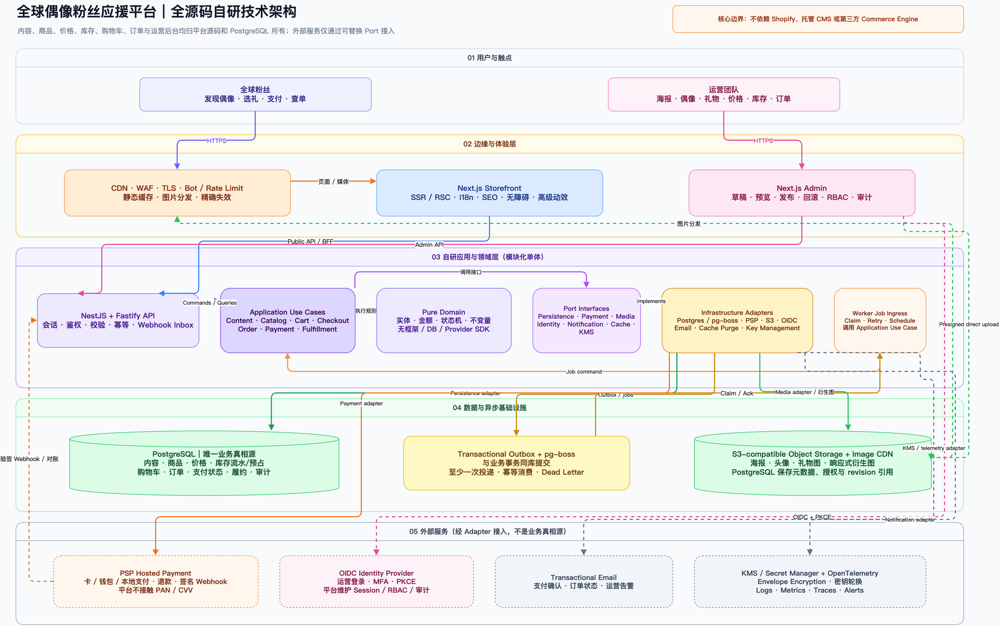

可编辑源文件：[fan-support-platform-architecture.drawio](fan-support-platform-architecture.drawio)

### 8.1 为什么推荐混合 Headless 架构

不建议首期完全照搬 WordPress/WooCommerce 插件堆叠，也不建议一开始就拆十几个微服务。

推荐组合：

- **Next.js + TypeScript**：前台、主播工作台和运营管理台；SSR/SEO、多语言、响应式。
- **NestJS 模块化单体**：自研应援核心；按领域拆模块但统一部署和数据库事务。
- **Shopify Commerce Adapter（首期）**：商品、购物车、结算、支付、订单；通过 line item properties/metafields 保存应援上下文，通过 webhook 驱动自研账本。
- **PostgreSQL**：主播、团队、活动、映射、应援分配账本、榜单、审计、分账台账。
- **Redis + 队列**：会话、限流、榜单缓存、webhook 重试、通知与异步任务。
- **对象存储 + CDN**：头像、活动海报、主播回执、导出文件。
- **支付适配层**：若未来迁出 Shopify，可接 Stripe/PayPal/地区支付，不改应援核心模型。

首期保留清晰的 `CommerceAdapter` 边界：业务代码不直接依赖 Shopify 数据结构。未来当多商户分账、定制结算或成本要求超过 Shopify 能力时，可替换为自研订单核或其他 commerce engine。

### 8.2 服务模块

| 模块 | 主要职责 |
|---|---|
| Identity | 游客会话、粉丝账号、主播/运营角色、权限 |
| Creator & Team | 主播、团队、社媒、授权、状态、资料 |
| Campaign | 活动、赛季、目标、时间窗口、倍率、规则 |
| Catalog Rules | 应援档位、适用主播、价格、数字/实体类型 |
| Cart Validation | 行项目归属、活动有效性、价格与数量校验 |
| Commerce Mapping | Shopify product/variant/order 与内部 ID 映射 |
| Payment Events | webhook 签名、幂等、重试、退款和争议 |
| Support Ledger | 支付后生成应援分配账目与反向冲销 |
| Leaderboard | 周期榜单、快照、缓存、规则解释 |
| Messages & Moderation | 留言、公开权限、过滤、举报和审核 |
| Acknowledgement | 主播确认、回执、状态和通知 |
| Settlement Ledger | 平台/主播/手续费/退款分录与导出 |
| Admin & Audit | 运营操作、审计日志、客服、异常修复 |

### 8.3 核心事件链

1. 前端读取主播、活动和应援档位。
2. 用户选择主播与活动，服务端校验并生成购物车上下文。
3. Commerce Adapter 把内部 `beneficiary_id/campaign_id/display_mode` 写入交易行属性。
4. 用户进入成熟的结算与支付流程。
5. Shopify/支付平台发送 `order paid` webhook。
6. Webhook Gateway 验证 HMAC、记录事件 ID、幂等入库并写 Outbox。
7. Worker 创建 `support_allocation` 和分账分录，更新榜单投影。
8. 通知粉丝和主播，状态变为 `ALLOCATED`。
9. 主播上传/确认回执，状态变为 `ACKNOWLEDGED/FULFILLED`。
10. 退款或拒付事件创建反向分录并重算榜单，不覆盖原始记录。

### 8.4 主要数据实体

- `users`, `profiles`, `roles`, `sessions`
- `creators`, `teams`, `creator_team_memberships`
- `campaigns`, `campaign_rules`, `seasons`
- `support_products`, `support_variants`, `creator_product_eligibility`
- `commerce_product_mappings`, `commerce_order_mappings`
- `carts`, `cart_items`
- `orders`, `order_items`, `payment_events`
- `support_allocations`, `allocation_reversals`
- `leaderboard_entries`, `leaderboard_snapshots`
- `fan_messages`, `moderation_actions`
- `acknowledgements`, `media_assets`
- `settlement_entries`, `payout_batches`
- `webhook_events`, `outbox_events`, `audit_logs`

所有金额用最小货币单位整数存储，例如 USD 88.00 存为 `8800`，并保留货币代码。订单行保存主播、活动、商品名称和规则快照，防止后续改名影响历史订单。

### 8.5 API 边界示例

- `GET /creators`, `GET /creators/:slug`
- `GET /campaigns`, `GET /campaigns/:id`
- `GET /support-products?creator_id=&campaign_id=`
- `POST /cart/validate`
- `POST /checkout/session`
- `POST /webhooks/shopify`
- `GET /orders/:id/status`
- `GET /leaderboards/:season_id`
- `POST /messages/:id/report`
- `POST /creator/acknowledgements`
- `POST /admin/refunds/:order_id/reconcile`

### 8.6 安全、隐私与可靠性

- webhook 必须验签、幂等、落原始事件、可重放。
- 管理操作使用 RBAC/ABAC、MFA、审计日志和高风险二次确认。
- PII 与公开资料分开访问；日志和分析事件不记录完整支付或敏感身份数据。
- 支付卡数据只由 PCI 合规支付页面处理，业务系统不落卡号。
- 对登录、搜索、购物车、优惠和结算做速率限制与 bot 保护。
- 高价、短时间重复、跨国家异常订单进入风控队列。
- 数据库开启时间点恢复；对象存储版本化；定期恢复演练。
- 建议初始目标：99.9% 可用性、核心 API p95 < 300ms、LCP < 2.5s、RPO ≤ 5 分钟、RTO ≤ 60 分钟；上线前根据地区和预算校准。

### 8.7 SEO、国际化与可访问性

- 主播、团队、活动和商品使用稳定 slug 与 canonical。
- 输出 Product、Organization、Breadcrumb 等结构化数据；虚拟应援不要伪装为需要配送的实物。
- 多语言内容使用真正的翻译工作流，不只机器翻译；维护 hreflang 和区域货币。
- 从组件层保证语义化标题、表单标签、错误关联、焦点顺序、键盘可操作和减少动画偏好。
- 发布门禁包括 320px 移动端、200% 缩放、键盘流程、屏幕阅读器冒烟和主要语言回归。

## 九、两条实施路线

### 路线 A：快速验证版（推荐首期）

`Shopify + 自研应援核心 + 定制前台`

- 优点：结算、支付、订单、多货币和基础运维成熟，上线快。
- 缺点：深度定制、多商户分账和复杂活动会受 Shopify 边界影响。
- 适合：先验证 10–100 名主播、日订单量中等、以跨境卡支付/PayPal 为主。

### 路线 B：完整平台版

`Next.js + NestJS + PostgreSQL + 自研订单/支付编排`

- 优点：应援、分账、退款、榜单和创作者门户完全可控。
- 缺点：支付、税务、对账、订单一致性和运维成本显著更高。
- 适合：明确要做多商户平台、复杂分账、多个国家支付或极高活动峰值。

建议先按路线 A 上线，同时按本报告的数据模型和 CommerceAdapter 边界设计，避免以后重写应援核心。

## 十、分阶段规划

### Phase 0：业务与合规确认（1–2 周）

- 明确应援是数字服务、礼物代购、捐助还是混合模式。
- 确认目标国家、币种、支付、退款、税务和主播授权。
- 定义榜单规则、主播回执、分账与客服 SLA。
- 输出 PRD、事件字典、数据分类和风险清单。

### Phase 1：产品与体验设计（2–3 周）

- 完成信息架构、关键流程、桌面/移动原型和设计系统。
- 对“选主播 → 选档位 → 结算 → 入榜 → 回执”做可用性测试。
- 先确定视觉方向，再进入实现；不要直接复制两个参考站的模板残留。

### Phase 2：MVP 实现（5–8 周）

- 粉丝前台、主播页、活动页、应援详情、购物车和结算。
- 自研应援核心、Shopify 映射、支付 webhook、应援账本和榜单。
- 运营后台、主播工作台、留言隐私、回执和通知。
- 多语言基础、SEO、分析、监控和备份。

### Phase 3：灰度与上线（2–3 周）

- 全链路支付沙盒、退款、重复 webhook、断网和重试测试。
- 内容/链接/政策检查，移动端和可访问性回归。
- 小批主播和小流量灰度，对账无误后逐步开放。

### Phase 4：增长与平台化

- 推荐系统、活动目标、团体应援、限时档位、分享卡片。
- 主播自动分账、财务对账、风控模型、客服工单。
- 搜索服务、实时榜单推送、数据仓库和 BI。
- 对话式商品发现/UCP/MCP 可作为后续能力，不应早于交易和账本正确性。

## 十一、MVP 验收门槛

- 每个订单行都能证明“给谁、哪场活动、哪个档位、什么价格”。
- 支付成功、失败、取消、退款、部分退款和拒付均可正确落账。
- 重复 webhook 不会重复入榜；乱序 webhook 可恢复。
- 退款后榜单和分账自动冲销且保留审计记录。
- 数字应援结算不显示配送地址；实体商品才要求配送。
- 粉丝留言默认私密，公开展示必须主动选择并可审核。
- 主播、运营和财务权限隔离；关键操作可追溯。
- 主要页面无 404、占位文案、错链和重复页脚项。
- 桌面、移动、键盘、主要语言和核心支付路径都通过回归。
- 上线前完成真实小额支付、退款、邮件、榜单入账和回执的端到端演练。

## 十二、当前最需要你决定的六件事

1. 首期目标市场与主要支付国家
2. “虚拟应援”实际交付什么，以及是否允许实体礼物
3. 主播数量、团队层级和预计商品规模
4. 是否需要自动分账，还是先人工结算
5. 榜单按金额、积分还是活动倍率计算
6. 希望 1–2 个月验证，还是直接建设长期平台

这些决定会影响使用 Shopify 混合方案还是全自研、合规成本、结算字段、数据库模型和首期时间。

## 附录 A：关键截图

### MXCHEER

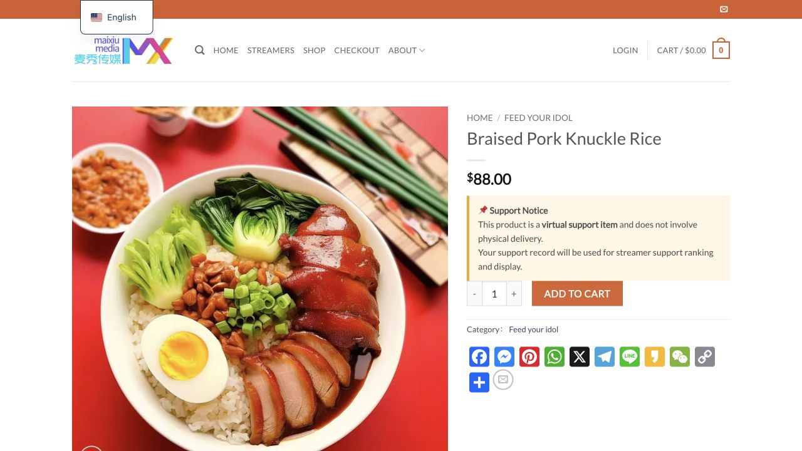

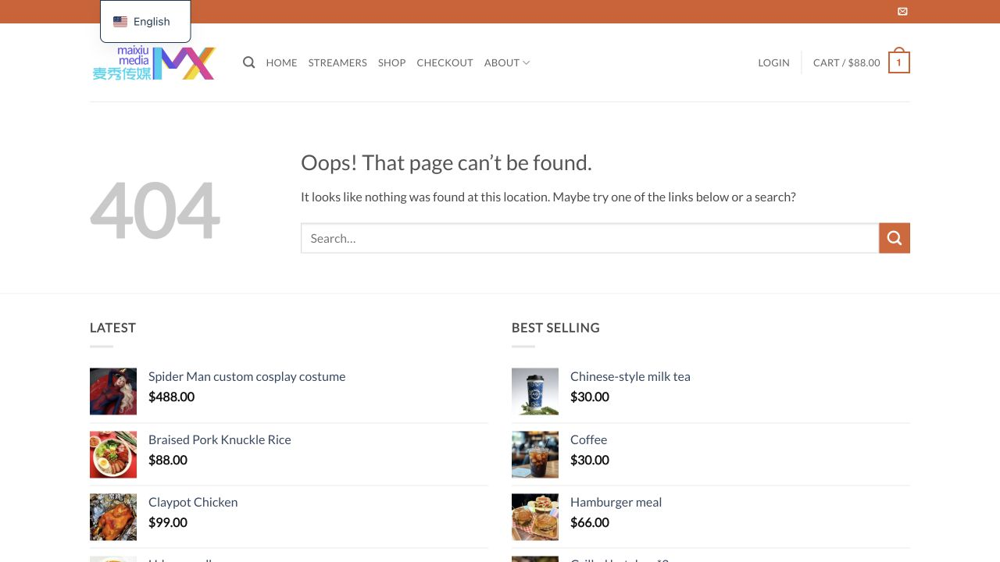

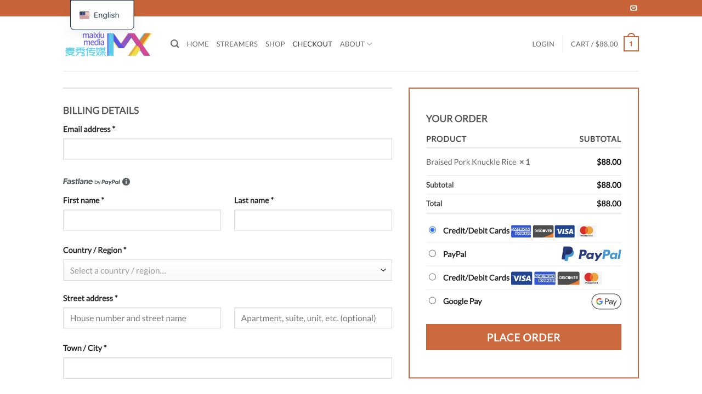

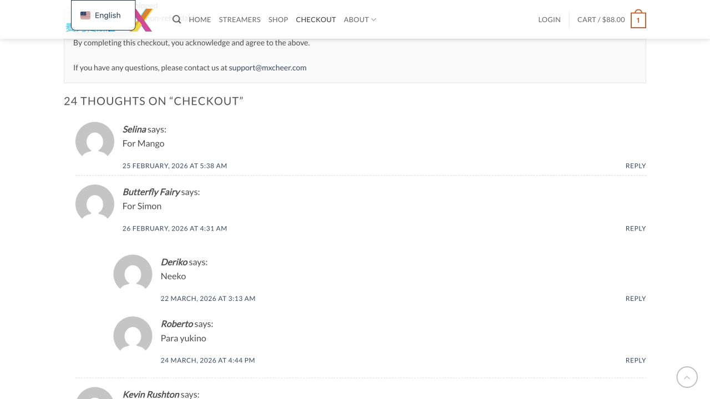

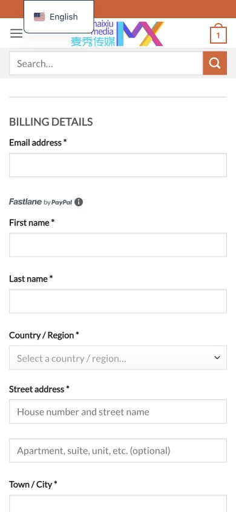

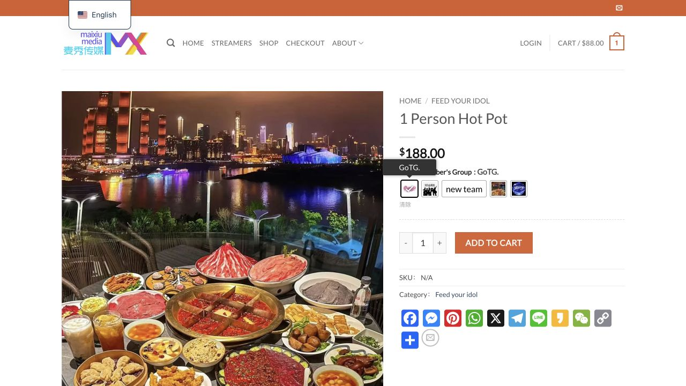

### Sonny / Vivid Live Star

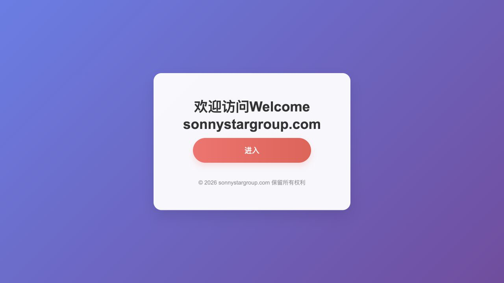

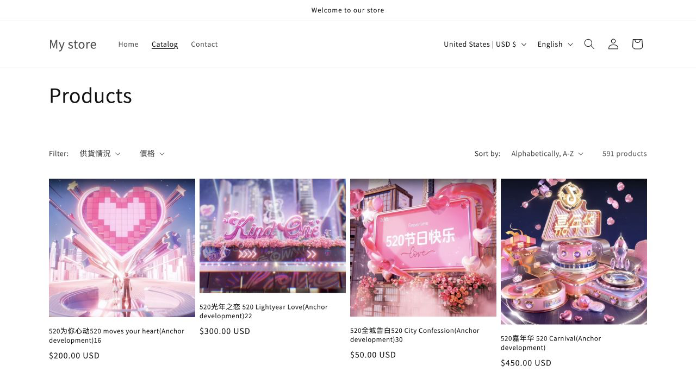

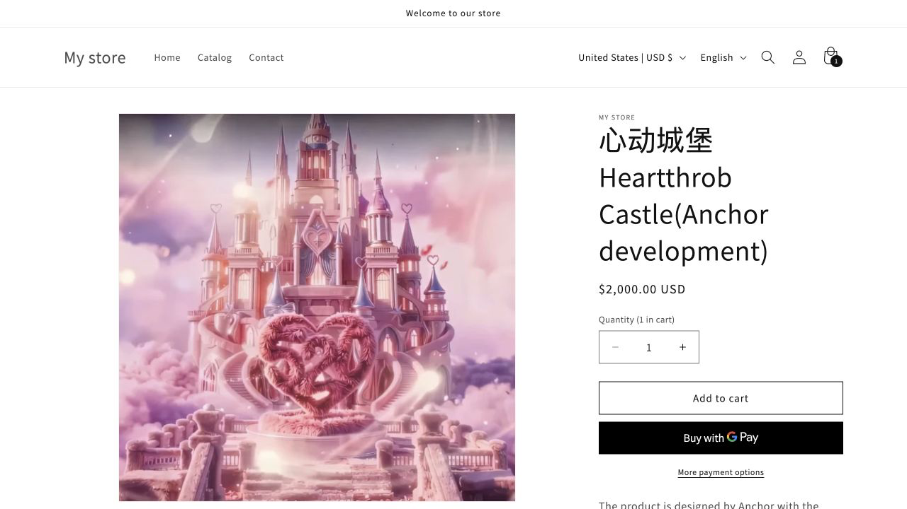

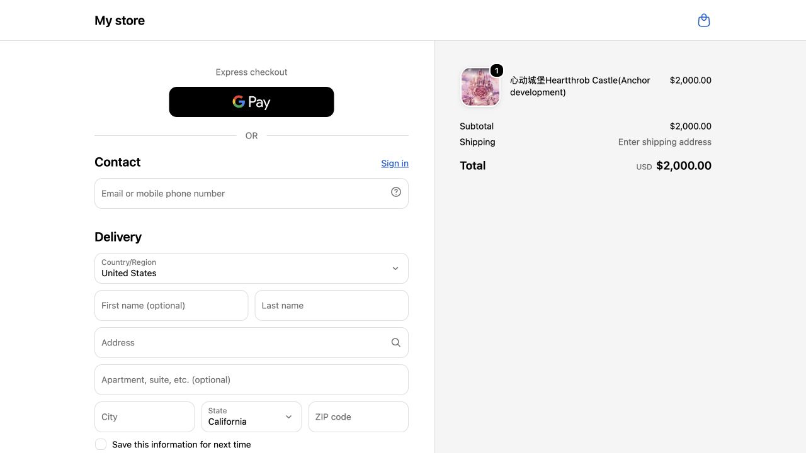

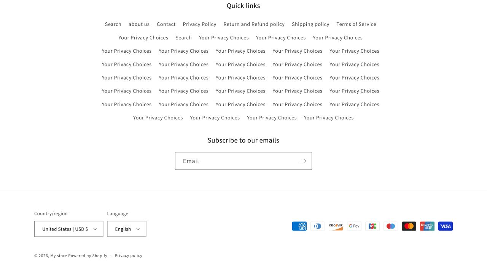

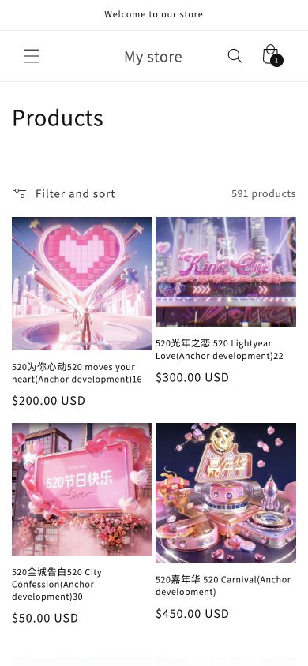

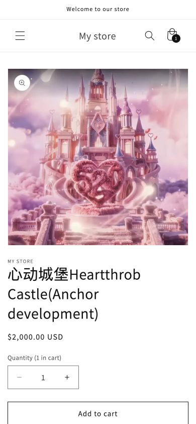

## 附录 B：本轮证据文件

- `research/mxcheer/`：MXCHEER 29 张连续编号流程截图与独立审计报告
- `research/sonnystar/`：Sonny 入口与 Vivid 商城 33 张连续编号流程截图
- `research/tech/`：两站技术指纹、性能/SEO/响应头证据、复现命令与架构建议
- `research/root-evidence/`：HTML、HTTP 头、robots、站点地图和公开接口证据
- `docs/fan-support-platform-architecture.drawio`：可编辑架构图
- `docs/fan-support-platform-architecture.png`：架构图预览
